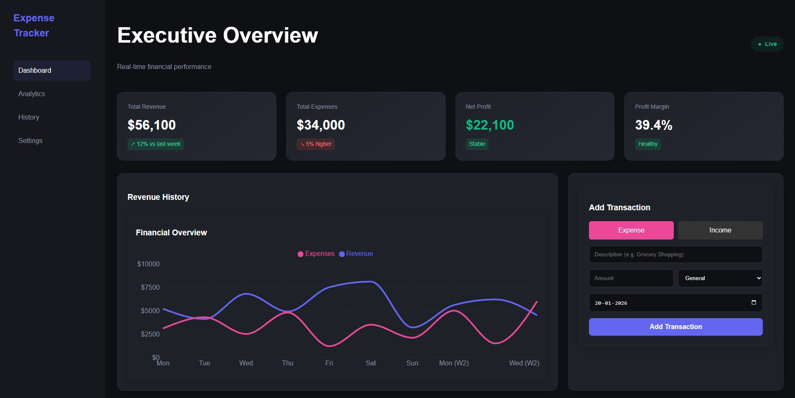
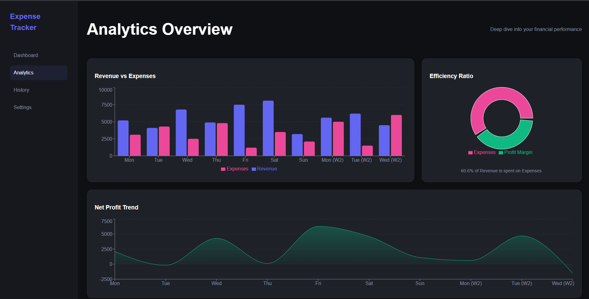
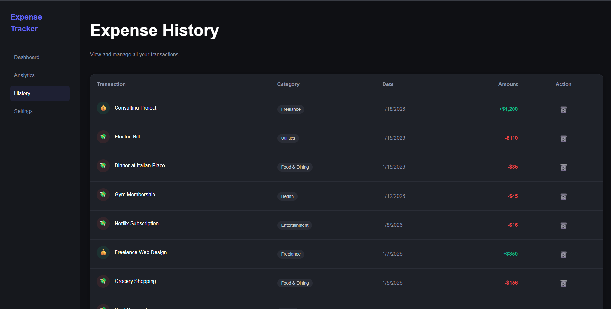
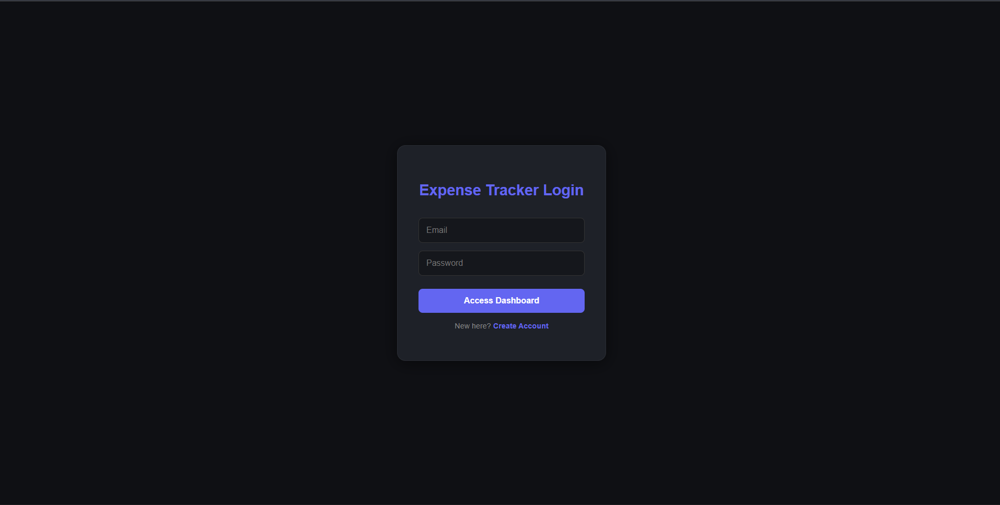

#  Expense Tracker


 ### A robust full-stack application leveraging MongoDB, Express, React, and Node.js to deliver a high-performance financial dashboard. This project integrates complex data visualization via Recharts with a secure RESTful API backend. Key technical highlights include JWT-based authentication, responsive CSS Grid layouts, and real-time state management for immediate UI updates upon data entry

---
### Live Demo :https://expense-tracker-frontend-eta-eight.vercel.app
## 📸 Screenshots

| **Executive Dashboard** | **Analytics Overview** |
|:---:|:---:|
|  |  |
| *Real-time financial overview with interactive charts.* | *Deep dive into revenue vs expenses and efficiency ratios.* |

| **Transaction History** | **Dark Mode UI** |
|:---:|:---:|
|  |  |
| *Full CRUD functionality for managing transactions.* | *Sleek, responsive dark-themed interface.* |

---

## ✨ Key Features

* **Interactive Visualizations:** Built with `Recharts` to display Revenue, Expenses, and Net Profit trends using Area, Bar, and Pie charts.
* **Secure Authentication:** Complete JWT-based authentication system with secure Login and Registration.
* **Transaction Management:** Full CRUD (Create, Read, Update, Delete) capabilities for financial records.
* **Responsive Design:** Custom CSS Grid layout ensuring seamless experience across Desktop, Tablet, and Mobile.
* **Real-Time Updates:** Instant UI updates upon data entry without page reloads.
* **Modern UI/UX:** Glassmorphism effects, gradient cards, and a polished dark mode aesthetic.

---

## 🛠️ Tech Stack

### **Frontend**
* **React (Vite):** For a blazing fast user interface.
* **Recharts:** For professional data visualization.
* **CSS3 (Grid/Flexbox):** Custom styling with no external CSS frameworks.
* **Axios:** For API integration.

### **Backend**
* **Node.js & Express:** Robust REST API architecture.
* **MongoDB & Mongoose:** NoSQL database for flexible data modeling.
* **JWT (JSON Web Tokens):** Stateless authentication mechanism.
* **Bcrypt.js:** Password hashing for security.

---

## 🚀 Getting Started

Follow these steps to run the project locally.

### **Prerequisites**
* Node.js (v14 or higher)
* MongoDB Atlas Account (or local MongoDB instance)
---

## 📂 Project Structure

A quick look at the top-level files and directories you'll see in this project.

```text
dashboard
├── public/               # Static assets
├── screenshots/          # Demo images
├── server/               # Backend API
│   ├── middleware/       # Auth verification
│   ├── models/           # DB Schemas (User, Transaction)
│   ├── routes/           # API Routes
│   └── index.js          # Entry point
├── src/                  #  Frontend
│   ├── components/       # Reusable widgets (Charts, Forms)
│   ├── pages/            # App Views (Dashboard, Analytics, History)
│   ├── styles/           # Global CSS
│   └── App.jsx           # Routing setup
├── .env                  # Environment secrets
└── README.md             # Documentation
```
### **Installation**

1.  **Clone the Repository**
    ```bash
    git clone [https://github.com/yadnik-kamble/Expense-Tracker-App.git](https://github.com/yadnik-kamble/Expense-Tracker-App.git)
    cd Expense-Tracker-App
    ```

2.  **Install Dependencies**
    ```bash
    # Install Root (Frontend) Dependencies
    npm install

    # Install Server (Backend) Dependencies
    cd server
    npm install
    cd ..
    ```

3.  **Environment Setup**
    Create a `.env` file in the `server/` directory and add the following:
    ```env
    MONGO_URI=your_mongodb_connection_string
    JWT_SECRET=your_super_secret_key
    PORT=5000
    ```

4.  **Run the Application**
    Open two terminals:

    *Terminal 1 (Backend):*
    ```bash
    cd server
    npm start
    ```

    *Terminal 2 (Frontend):*
    ```bash
    npm run dev
    ```

5.  **Access the App**
    Open your browser and navigate to `http://localhost:5173`.

---

## 🔌 API Endpoints

| Method | Endpoint | Description | Auth Required |
| :--- | :--- | :--- | :---: |
| `POST` | `/api/auth/register` | Register a new user | ❌ |
| `POST` | `/api/auth/login` | Login and receive JWT | ❌ |
| `GET` | `/api/dashboard/transactions` | Fetch all user transactions | ✅ |
| `POST` | `/api/dashboard/transactions` | Add a new transaction | ✅ |
| `DELETE` | `/api/dashboard/transactions/:id` | Delete a transaction | ✅ |

---

## 🔮 Future Improvements

* [ ] **AI Insights:** Integrate OpenAI API to provide spending advice based on history.
* [ ] **Export to CSV:** Allow users to download their financial reports.
* [ ] **Budget Goals:** Set monthly limits and visual progress bars.
* [ ] **Recurring Payments:** Auto-add subscription costs every month.

---

## 🤝 Contributing

Contributions are always welcome!

1.  Fork the Project
2.  Create your Feature Branch (`git checkout -b feature/AmazingFeature`)
3.  Commit your Changes (`git commit -m 'Add some AmazingFeature'`)
4.  Push to the Branch (`git push origin feature/AmazingFeature`)
5.  Open a Pull Request

---


